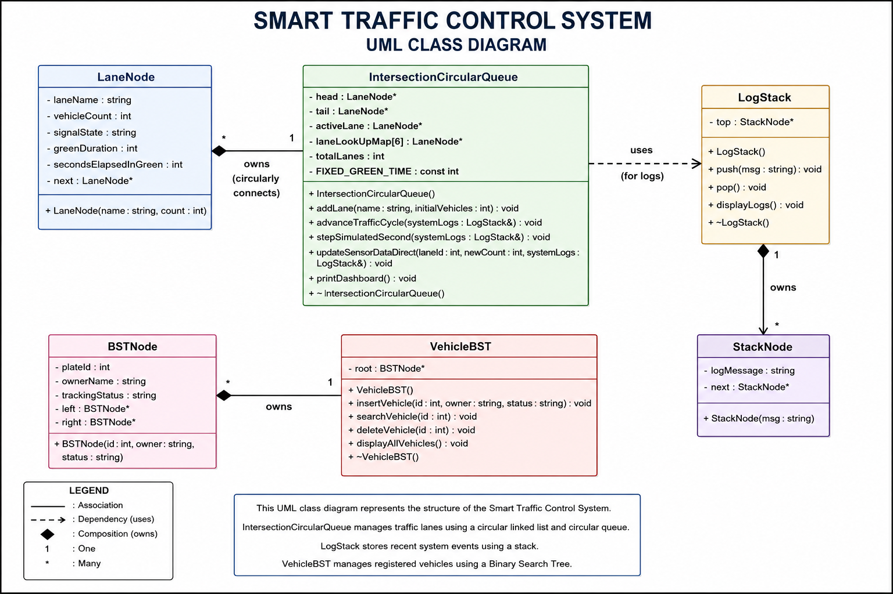

<h1 align="center">🚦 Smart Traffic Control System</h1>

<p align="center">
  
  
  
  
  
</p>

<p align="center">
A C++ console-based Smart Traffic Control System developed for the Data Structures course. This project demonstrates the practical implementation of Circular Linked List, Circular Queue, Stack, Array, and Binary Search Tree (BST) in a traffic management simulation.
</p>

---

# 📌 Overview

The **Smart Traffic Control System** is a menu-driven console application that simulates traffic management at a four-way intersection.

The project demonstrates how multiple Data Structures work together in a single application.

The system:

- Simulates traffic signal rotation.
- Maintains vehicle counts for each traffic lane.
- Stores recent system events using a Stack.
- Provides O(1) lane lookup using an Array.
- Maintains registered vehicle records using a Binary Search Tree (BST).

This project was developed as a **Data Structures Semester Project** at the **University of Central Punjab (UCP)**.

---

# 🎯 Project Objectives

- Demonstrate practical implementation of Data Structures.
- Simulate traffic signal management.
- Manage vehicle counts efficiently.
- Store system logs using a Stack.
- Maintain vehicle records using BST.
- Develop a complete menu-driven application.

---

# ✨ Features

| Feature | Description |
|---------|-------------|
| 🚦 Traffic Signal Management | Simulates traffic signal rotation |
| 🚗 Lane Vehicle Monitoring | Maintains vehicle count for every lane |
| ⚡ Manual Lane Update | Update lane traffic using O(1) Array lookup |
| 📚 System Logs | Store recent traffic events using Stack |
| 🌳 Vehicle Registry | Manage vehicle records using BST |
| ➕ Add Vehicle | Insert vehicle into BST |
| 🔍 Search Vehicle | Search vehicle by Plate ID |
| ❌ Delete Vehicle | Delete vehicle from BST |
| 📋 Display Vehicle Registry | Display all vehicles using Inorder Traversal |
| 🖥️ Interactive Menu | Console-based menu system |

---

# ✅ Core Data Structures

| Data Structure | Purpose |
|---------------|---------|
| Circular Linked List | Connects all traffic lanes |
| Circular Queue | Rotates traffic signals |
| Array | Provides O(1) lane lookup |
| Stack | Stores recent system logs |
| Binary Search Tree | Maintains registered vehicle records |

---

# 🔗 How Each Data Structure Is Used

| Data Structure | Usage in Project |
|---------------|------------------|
| Circular Linked List | Maintains the circular connection between all traffic lanes |
| Circular Queue | Controls traffic signal rotation |
| Array | Provides direct lane lookup for manual updates |
| Stack | Stores recent traffic events using LIFO |
| Binary Search Tree | Stores registered vehicle records and supports Insert, Search and Delete operations |

---

# 🌳 Binary Search Tree Operations

| Operation | Status |
|----------|--------|
| Insert | ✅ |
| Search | ✅ |
| Delete | ✅ |
| Inorder Traversal | ✅ |

---

# 📋 Main Menu

```text
================ SYSTEM MENU ================

1. Simulate One Second
2. Update Lane Traffic
3. View System Logs
4. Add Vehicle to Registry
5. Search Vehicle
6. Delete Vehicle
7. Display Vehicle Registry
8. Exit
```

---

# ⚙️ Algorithms Used

| Algorithm | Purpose |
|-----------|---------|
| Circular Queue Rotation | Traffic Signal Management |
| BST Insert | Register Vehicle |
| BST Search | Search Vehicle |
| BST Delete | Remove Vehicle |
| Inorder Traversal | Display Vehicle Registry |
| Stack Push | Store Traffic Events |
| Stack Pop | Remove Recent Events |

---

# ⏱️ Time Complexity

| Operation | Complexity |
|-----------|------------|
| Array Lookup | **O(1)** |
| Traffic Signal Rotation | **O(1)** |
| Stack Push | **O(1)** |
| Stack Pop | **O(1)** |
| BST Insert | **O(log n)** *(Average)* |
| BST Search | **O(log n)** *(Average)* |
| BST Delete | **O(log n)** *(Average)* |
| BST Inorder Traversal | **O(n)** |

---

# 📂 Project Structure

```text
Smart-Traffic-Control-System-DSA/
│
├── LaneNode.h
├── TrafficQueue.h
├── LogStack.h
├── VehicleBST.h
├── main.cpp
│
├── Smart_Traffic_Control_System_Report.docx
├── Smart_Traffic_Control_System_UML.png
│
├── README.md
├── LICENSE
└── .gitignore
```

---

# 📑 Project Documentation

The repository also contains complete project documentation.

| File | Description |
|------|-------------|
| **Smart_Traffic_Control_System_Report.docx** | Complete semester project report including objectives, implementation, data structures, UML diagram, algorithms, and conclusion. |
| **Smart_Traffic_Control_System_UML.png** | UML Class Diagram representing the architecture and relationships between all project classes. |

---

# 🏗️ UML Class Diagram

<p align="center">
  
</p>

The UML Class Diagram illustrates the relationships between all classes used in the project, including:

- LaneNode
- IntersectionCircularQueue
- LogStack
- StackNode
- VehicleBST
- BSTNode

The diagram also represents composition relationships and dependencies between the implemented data structures.

---

# 📄 Project Report

A complete semester project report is included in this repository.

The report contains:

- Project Introduction
- Project Objectives
- Project Overview
- Data Structures Used
- System Working
- UML Class Diagram
- Relationship Explanation
- Algorithms
- Time Complexity Analysis
- Advantages
- Limitations
- Future Enhancements
- Conclusion

📄 **Report File**

```text
Smart_Traffic_Control_System_Report.docx
```

---

# ▶️ How to Run

## 🖥️ Visual Studio (Recommended)

1. Open **Visual Studio**.
2. Create a new **Empty C++ Project**.
3. Add all `.h` and `.cpp` files to the project.
4. Build the solution.
5. Press **Ctrl + F5** to run the application.

---

## 💻 VS Code

Open the project folder and run:

```bash
g++ *.cpp -o TrafficSystem
./TrafficSystem
```

---

## 🖱️ Dev C++

1. Open the project.
2. Compile the project.
3. Run the executable.

---

# 🎓 Learning Outcomes

This project demonstrates practical implementation of the following Data Structures and concepts:

- Arrays
- Circular Linked List
- Circular Queue
- Stack
- Binary Search Tree (BST)
- Dynamic Memory Allocation
- Menu-Driven Programming
- Object-Oriented Programming (OOP)
- Traffic Management Simulation
- Time Complexity Analysis

---

# 🚀 Future Enhancements

The following improvements can be added in future versions:

- 🚑 Emergency Vehicle Priority System
- 📊 Adaptive Traffic Signal Timing
- 💾 File Handling for Saving and Loading Data
- 🌳 AVL Tree for Balanced Vehicle Records
- 🛣️ Multi-Intersection Traffic Management
- 🗺️ Graph-Based Road Network
- 🖥️ Graphical User Interface (GUI)

---

# 🛠️ Technologies Used

| Technology | Purpose |
|------------|---------|
| **C++** | Programming Language |
| **Visual Studio** | Development Environment |
| **Console Application** | User Interface |
| **Object-Oriented Programming** | System Design |
| **Data Structures** | Core Project Implementation |

---

# 📊 Project Summary

| Category | Details |
|----------|---------|
| Project Type | Semester Project |
| Course | Data Structures |
| Programming Language | C++ |
| Interface | Console Application |
| Data Structures | Circular Linked List, Circular Queue, Stack, Array, BST |
| Development Environment | Visual Studio |

---

# 🎓 Academic Information

| Field | Details |
|-------|---------|
| **University** | University of Central Punjab (UCP) |
| **Course** | Data Structures |
| **Semester** | BSCS |
| **Project Type** | Semester Project |

---

# 👨‍💻 Developer

**Name:** Irfan

**Registration No:** L1F24BSCS0580

---

# 📄 License

This project is licensed under the **MIT License**.

For more information, see the **LICENSE** file included in this repository.

---

# ⭐ Support

If you found this project useful or learned something from it, consider giving the repository a ⭐ on GitHub.

It helps others discover the project and supports future improvements.

---

<h3 align="center">⭐ Thank you for visiting this repository! ⭐</h3>
